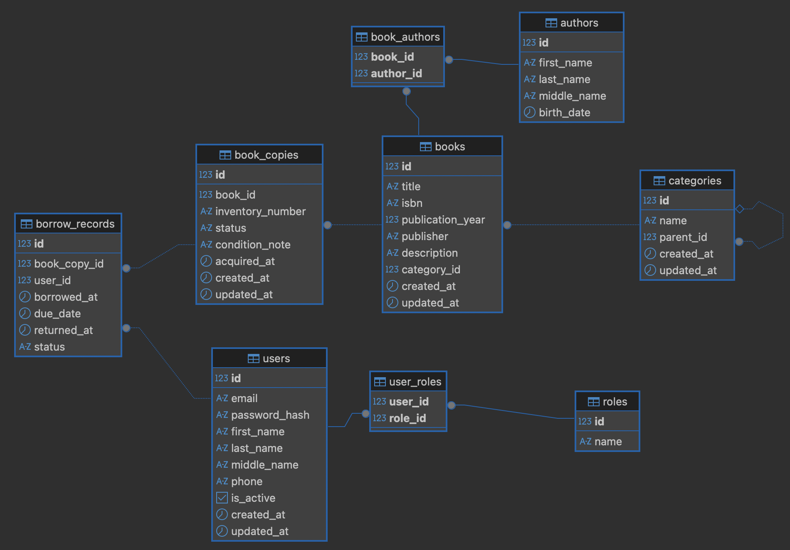

# 📚 Library Management System (LMS)

[](https://www.oracle.com/java/)
[](https://spring.io/)
[](https://www.postgresql.org/)
[](https://tomcat.apache.org/)
[](https://www.docker.com/)
[](https://swagger.io/)
[](LICENSE)

**Полнофункциональная система управления библиотекой** — RESTful API приложение на Java 17 с детальным логированием, гибким поиском, управлением выдачей книг и контролем сроков возврата.

---

## 📑 Содержание

- [Описание проекта](#-описание-проекта)
- [Функциональные возможности](#-функциональные-возможности)
  - [Обычный пользователь (USER)](#-обычный-пользователь-user)
  - [Администратор (ADMIN)](#-администратор-admin)
- [Технологический стек](#-технологический-стек)
- [ER-диаграмма базы данных](#-er-диаграмма-базы-данных)
- [Структура проекта](#-структура-проекта)
- [API Документация (Swagger)](#-api-документация-swagger)
- [Установка и запуск](#-установка-и-запуск)
  - [Предварительные требования](#предварительные-требования)
  - [1. Клонирование репозитория](#1-клонирование-репозитория)
  - [2. Настройка переменных окружения](#2-настройка-переменных-окружения)
  - [3. Сборка проекта (Maven)](#3-сборка-проекта-maven)
  - [4. Запуск через Docker Compose](#4-запуск-через-docker-compose)
  - [5. Ручной запуск (без Docker)](#5-ручной-запуск-без-docker)

---

## 📖 Описание проекта

**Library Management System** — это серверное REST API приложение для автоматизации библиотечных процессов: учёта книг, авторов, категорий, экземпляров книг, а также выдачи и возврата книг читателями.

**Ключевые особенности:**
- 🔐 **JWT-аутентификация и авторизация** (роли USER и ADMIN)
- 📚 **Полноценный учёт книжного фонда** с экземплярами и инвентарными номерами
- 🔍 **Гибкий поиск** книг по названию, автору, категории и ISBN
- 📅 **Управление выдачей книг** с контролем сроков и просрочек
- 📊 **Детальное логирование** всех операций
- 🗂️ **Иерархическая структура категорий** (дерево категорий)
- 📄 **Swagger UI** для тестирования API
- 🐳 **Docker Compose** для быстрого развёртывания

---

## 🎯 Функциональные возможности

### 👤 Обычный пользователь (USER)

После регистрации и входа в систему пользователь может:

#### 🔐 Аутентификация
- **Регистрация** нового аккаунта (username, email, пароль, имя, фамилия)
- **Вход в систему** — получение JWT-токена для доступа к API
- Автоматическое назначение роли `ROLE_USER` при регистрации

#### 📚 Работа с каталогом
- **Просмотр всех книг** библиотеки
- **Детальный просмотр книги** со списком авторов и категорией
- **Поиск книг** по:
  - Названию (или части названия)
  - Автору (по фамилии)
  - Категории (по ID)
  - ISBN
- **Просмотр книг по категориям**
- **Просмотр книг конкретного автора**
- **Поиск книги по точному ISBN**

#### 📋 Работа с авторами и категориями
- Просмотр списка всех авторов
- Поиск авторов по фамилии
- Просмотр детальной информации об авторе
- Просмотр всех категорий
- Просмотр корневых категорий и подкатегорий

#### 📦 Экземпляры книг
- Просмотр всех экземпляров книг
- Просмотр экземпляров конкретной книги
- Просмотр доступных экземпляров (со статусом `AVAILABLE`)
- Поиск экземпляра по инвентарному номеру
- Фильтрация экземпляров по статусу

#### 📅 Выдача и возврат книг
- **Взять книгу** (оформить выдачу) — только доступные экземпляры
- **Вернуть книгу** (оформить возврат)
- **Продлить срок аренды** книги
- Просмотр истории своих выдач
- Просмотр текущих (активных) выдач
- Просмотр просроченных выдач

#### 👤 Профиль
- Просмотр своего профиля
- Редактирование профиля (email, имя, фамилия, телефон)

---

### 👑 Администратор (ADMIN)

Администратор обладает **всеми правами пользователя**, а также:

#### 📚 Управление книгами
- **Создание** новых книг (название, ISBN, описание, год, категория, авторы)
- **Редактирование** информации о книгах
- **Удаление** книг из каталога

#### ✍️ Управление авторами
- **Добавление** новых авторов
- **Редактирование** данных авторов
- **Удаление** авторов

#### 🗂️ Управление категориями
- **Создание** категорий (с возможностью указания родительской)
- **Редактирование** категорий
- **Удаление** категорий
- Построение иерархии категорий

#### 📦 Управление экземплярами
- **Добавление** экземпляров книг (с инвентарным номером)
- **Редактирование** экземпляров
- **Изменение статуса** экземпляра:
  - `AVAILABLE` — доступен
  - `BORROWED` — выдан
  - `LOST` — утерян
  - `DAMAGED` — повреждён
  - `REPAIR` — в ремонте
- **Удаление** экземпляров

#### 👥 Управление пользователями
- Просмотр списка **всех пользователей**
- Просмотр **активных пользователей**
- Просмотр профиля любого пользователя
- **Удаление** (деактивация) пользователей

#### 📊 Мониторинг выдач
- Просмотр **всех записей** о выдачах
- Просмотр **текущих выдач** (статус `BORROWED`)
- Просмотр **просроченных выдач** (превышен срок возврата)
- Просмотр выдач по конкретному пользователю или экземпляру

---

## 🛠️ Технологический стек

### Backend
| Технология | Версия | Назначение |
|-----------|--------|------------|
| **Java** | 17 | Язык программирования |
| **Spring MVC** | 6.1.14 | Web-фреймворк, REST контроллеры |
| **Spring Security** | 6.2.4 | Аутентификация и авторизация |
| **Hibernate** | 6.6.4 | ORM для работы с БД |
| **JPA (Jakarta Persistence)** | 3.1.0 | Спецификация для ORM |

### База данных и миграции
| Технология | Версия | Назначение |
|-----------|--------|------------|
| **PostgreSQL** | 16 | Реляционная база данных |
| **Liquibase** | 4.29.2 | Управление миграциями схемы БД |

### Безопасность
| Технология | Версия | Назначение |
|-----------|--------|------------|
| **JWT (jjwt)** | 0.12.5 | JSON Web Tokens для аутентификации |
| **BCrypt** | — | Хеширование паролей |

### Документация и инструменты
| Технология | Версия | Назначение |
|-----------|--------|------------|
| **Swagger/OpenAPI** | 2.5.0 | Документирование REST API |
| **Lombok** | 1.18.38 | Уменьшение шаблонного кода |
| **MapStruct** | 1.6.3 | Маппинг Entity ↔ DTO |
| **SLF4J + Logback** | 2.0.16 | Логирование |
| **Jackson** | 2.17.2 | JSON-сериализация |

### Развёртывание
| Технология | Версия | Назначение |
|-----------|--------|------------|
| **Apache Tomcat** | 10.1 | Сервер приложений |
| **Docker** | — | Контейнеризация |
| **Maven** | 3.13.0 | Сборка и управление зависимостями |

---

## 🗂️ ER-диаграмма базы данных



### Описание таблиц:

- **`users`** — пользователи системы (читатели и администраторы)
- **`roles`** — роли (`ROLE_USER`, `ROLE_ADMIN`)
- **`user_roles`** — связь Many-to-Many пользователей и ролей
- **`books`** — книги (название, ISBN, описание, год)
- **`authors`** — авторы книг
- **`book_authors`** — связь Many-to-Many книг и авторов
- **`categories`** — категории книг (иерархическая структура через `parent_id`)
- **`book_copies`** — физические экземпляры книг (инвентарный номер, статус)
- **`borrow_records`** — записи о выдаче/возврате книг

### Статусы экземпляров книг:
- `AVAILABLE` — доступен для выдачи
- `BORROWED` — выдан читателю
- `LOST` — утерян
- `DAMAGED` — повреждён
- `REPAIR` — в ремонте

### Статусы записей выдачи:
- `BORROWED` — книга выдана
- `RETURNED` — книга возвращена
- `OVERDUE` — срок возврата истёк

---

## 📁 Структура проекта

```text
library-management-system/
├── src/
│   ├── main/
│   │   ├── java/by/slava_borisov/library/
│   │   │   ├── config/            # Конфигурация Spring, Security, JPA
│   │   │   ├── controller/rest/   # REST-контроллеры
│   │   │   │   ├── AuthController.java
│   │   │   │   ├── AuthorController.java
│   │   │   │   ├── BookController.java
│   │   │   │   ├── BookCopyController.java
│   │   │   │   ├── BorrowRecordController.java
│   │   │   │   ├── CategoryController.java
│   │   │   │   └── UserController.java
│   │   │   ├── dao/               # Data Access Objects (репозитории)
│   │   │   ├── dto/               # Data Transfer Objects
│   │   │   │   ├── request/       # Входящие DTO
│   │   │   │   └── response/      # Исходящие DTO
│   │   │   ├── exception/         # Кастомные исключения
│   │   │   ├── mapper/            # MapStruct мапперы
│   │   │   ├── model/             # JPA Entity
│   │   │   │   └── enums/         # Перечисления (статусы)
│   │   │   ├── security/          # JWT фильтры, провайдеры
│   │   │   ├── service/           # Бизнес-логика
│   │   │   │   └── impl/          # Реализации сервисов
│   │   │   └── util/              # Утилиты (Messages)
│   │   └── resources/
│   │       ├── db.changelog/      # Liquibase миграции
│   │       │   └── changelog-master.yaml
│   │       └── application.properties
│   └── test/                      # Unit и интеграционные тесты
├── docs/
│   └── images/
│       └── database-schema.png    # ER-диаграмма
├── .env.example                   # Пример переменных окружения
├── docker-compose.yml             # Docker Compose конфигурация
├── Dockerfile                     # Инструкция сборки Docker образа
├── pom.xml                        # Maven зависимости и плагины
└── README.md                      # Этот файл
```

---
## 📡 API Документация (Swagger)

После запуска приложения Swagger UI доступен по адресу:  
🔗 **http://localhost:8082/swagger-ui/index.html**

### Основные эндпоинты API:

#### 🔐 Аутентификация (`/api/auth`)
| Метод | Эндпоинт | Доступ | Описание |
|-------|----------|--------|----------|
| POST | `/api/auth/register` | Все | Регистрация нового пользователя |
| POST | `/api/auth/login` | Все | Вход и получение JWT-токена |

#### 📚 Книги (`/api/books`)
| Метод | Эндпоинт | Доступ | Описание |
|-------|----------|--------|----------|
| GET | `/api/books` | USER, ADMIN | Все книги |
| GET | `/api/books/search` | USER, ADMIN | Поиск книг |
| GET | `/api/books/{bookId}` | USER, ADMIN | Книга по ID |
| GET | `/api/books/{bookId}/details` | USER, ADMIN | Детальная информация |
| GET | `/api/books/{bookId}/available-copies` | USER, ADMIN | Доступные экземпляры |
| POST | `/api/books` | ADMIN | Создать книгу |
| PUT | `/api/books/{bookId}` | ADMIN | Обновить книгу |
| DELETE | `/api/books/{bookId}` | ADMIN | Удалить книгу |

#### ✍️ Авторы (`/api/authors`)
| Метод | Эндпоинт | Доступ | Описание |
|-------|----------|--------|----------|
| GET | `/api/authors` | USER, ADMIN | Все авторы |
| GET | `/api/authors/search` | USER, ADMIN | Поиск по фамилии |
| GET | `/api/authors/{authorId}` | USER, ADMIN | Автор по ID |
| POST | `/api/authors` | ADMIN | Создать автора |
| PUT | `/api/authors/{authorId}` | ADMIN | Обновить автора |
| DELETE | `/api/authors/{authorId}` | ADMIN | Удалить автора |

#### 🗂️ Категории (`/api/categories`)
| Метод | Эндпоинт | Доступ | Описание |
|-------|----------|--------|----------|
| GET | `/api/categories` | USER, ADMIN | Все категории |
| GET | `/api/categories/root` | USER, ADMIN | Корневые категории |
| GET | `/api/categories/{categoryId}` | USER, ADMIN | Категория по ID |
| GET | `/api/categories/{parentId}/subcategories` | USER, ADMIN | Подкатегории |
| POST | `/api/categories` | ADMIN | Создать категорию |
| PUT | `/api/categories/{categoryId}` | ADMIN | Обновить категорию |
| DELETE | `/api/categories/{categoryId}` | ADMIN | Удалить категорию |

#### 📦 Экземпляры книг (`/api/book-copies`)
| Метод | Эндпоинт | Доступ | Описание |
|-------|----------|--------|----------|
| GET | `/api/book-copies` | USER, ADMIN | Все экземпляры |
| GET | `/api/book-copies/{copyId}` | USER, ADMIN | Экземпляр по ID |
| GET | `/api/book-copies/inventory/{inventoryNumber}` | USER, ADMIN | По инвентарному номеру |
| GET | `/api/book-copies/book/{bookId}` | USER, ADMIN | Экземпляры книги |
| GET | `/api/book-copies/book/{bookId}/available` | USER, ADMIN | Доступные экземпляры |
| GET | `/api/book-copies/status/{status}` | USER, ADMIN | Фильтр по статусу |
| POST | `/api/book-copies` | ADMIN | Создать экземпляр |
| PUT | `/api/book-copies/{copyId}` | ADMIN | Обновить экземпляр |
| PATCH | `/api/book-copies/{copyId}/status` | ADMIN | Изменить статус |
| DELETE | `/api/book-copies/{copyId}` | ADMIN | Удалить экземпляр |

#### 📅 Выдача книг (`/api/borrow-records`)
| Метод | Эндпоинт | Доступ | Описание |
|-------|----------|--------|----------|
| GET | `/api/borrow-records` | ADMIN | Все записи выдач |
| GET | `/api/borrow-records/current` | ADMIN | Текущие выдачи |
| GET | `/api/borrow-records/overdue` | ADMIN | Просроченные выдачи |
| GET | `/api/borrow-records/{borrowRecordId}` | USER, ADMIN | Запись по ID |
| GET | `/api/borrow-records/user/{userId}` | USER, ADMIN | Выдачи пользователя |
| GET | `/api/borrow-records/user/{userId}/current` | USER, ADMIN | Активные выдачи |
| GET | `/api/borrow-records/user/{userId}/history` | USER, ADMIN | История выдач |
| GET | `/api/borrow-records/user/{userId}/overdue` | USER, ADMIN | Просрочки пользователя |
| POST | `/api/borrow-records/borrow` | USER, ADMIN | Взять книгу |
| POST | `/api/borrow-records/return` | USER, ADMIN | Вернуть книгу |
| POST | `/api/borrow-records/{borrowRecordId}/extend` | USER, ADMIN | Продлить срок |

#### 👤 Пользователи (`/api/users`)
| Метод | Эндпоинт | Доступ | Описание |
|-------|----------|--------|----------|
| GET | `/api/users` | ADMIN | Все пользователи |
| GET | `/api/users/active` | ADMIN | Активные пользователи |
| GET | `/api/users/{userId}` | ADMIN | Пользователь по ID |
| GET | `/api/users/{userId}/profile` | USER, ADMIN | Профиль пользователя |
| PUT | `/api/users/{userId}/profile` | USER, ADMIN | Обновить профиль |
| DELETE | `/api/users/{userId}` | ADMIN | Удалить пользователя |

---

## 🚀 Установка и запуск

### Предварительные требования

Для запуска проекта вам потребуется:

- **JDK 17** или выше ([скачать](https://adoptium.net/))
- **Maven 3.9+** ([скачать](https://maven.apache.org/download.cgi))
- **Docker** и **Docker Compose** ([скачать](https://www.docker.com/products/docker-desktop))
- **Git** ([скачать](https://git-scm.com/))

---

### 1. Клонирование репозитория

Откройте терминал и выполните:

```bash
git clone https://github.com/vyachic007/library-management-system.git
cd library-management-system
```

### 2. Настройка переменных окружения

Создайте файл .env в корне проекта со следующим содержимым:

# Настройки приложения
```env
APP_PORT=8082
APP_CONTAINER_NAME=library-app

# Настройки базы данных
DB_CONTAINER_NAME=library-postgres
DB_URL=jdbc:postgresql://db:5432/library_db
DB_USERNAME=library_user
DB_PASSWORD=library_password
POSTGRES_DB=library_db
POSTGRES_USER=library_user
POSTGRES_PASSWORD=library_password
POSTGRES_PORT=5435


# JWT секретный ключ (минимум 32 символа)
JWT_SECRET=your-super-secret-key-minimum-32-characters-long
JWT_EXPIRATION_MS=86400000
```

> [!WARNING]
> Замените `JWT_SECRET` на свой уникальный ключ (не менее 32 символов).
> Значение по умолчанию в `application.properties` используется только для разработки.


### 3. Сборка проекта (Maven)

Выполните сборку WAR-файла:
```bash
mvn clean package
```

После успешной сборки в папке `target/` появится файл:  
`library-management-system-1.0-SNAPSHOT.war`

### 4. Запуск через Docker Compose

Запустите приложение вместе с PostgreSQL:
```bash
docker-compose up -d
```


Что произойдёт:
- Запустится контейнер с PostgreSQL 16 (порт 5435)
- Будут выполнены миграции Liquibase (создание таблиц)
- Запустится контейнер с Tomcat 10.1 и вашим приложением (порт 8082)
- 
Проверка запуска:
```bash
docker-compose ps
```

Ожидаемый результат — оба контейнера со статусом Up:
```text
NAME                   STATUS
library-postgres       Up (healthy)
library-app            Up
```


Просмотр логов:
# Логи приложения
```bash
docker-compose logs -f app
```

# Логи базы данных
```bash
docker-compose logs -f db
```

